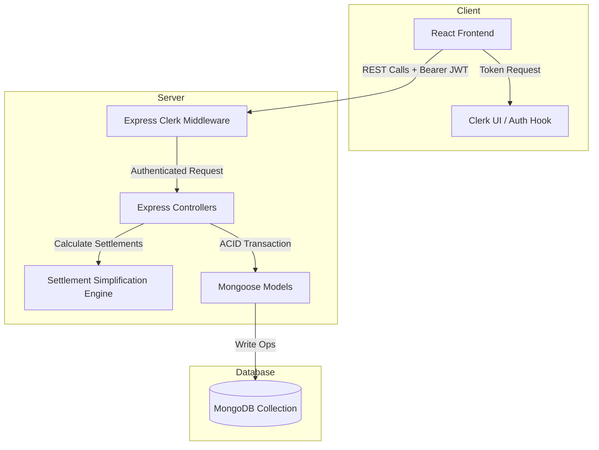

# Architecture Spine — Smart Expense Splitter

## Design Paradigm
The application uses a **Client-Server Layered Architecture**:
* **Client Layer (React):** Responsible for UI rendering, Clerk session token management, and form/modal states.
* **API Routing Layer (Express):** Exposes RESTful endpoints, handles JSON payloads, and validates Clerk auth tokens.
* **Service/Business Logic Layer:** Implements the greedy debt simplification engine.
* **Data Access Layer (Mongoose/MongoDB):** Maintains schemas, indexes, and manages multi-document ACID transactions.



## Invariants & Rules

### AD-1 — Strict Client-Server Separation
* **Binds:** `all`
* **Prevents:** Mixing frontend and backend logic or sharing code dependencies.
* **Rule:** The React frontend (client) and Express backend (server) must run as separate, decoupled packages. Communication occurs exclusively via stateless HTTPS REST APIs.

### AD-2 — Database Transaction Boundary (ACID)
* **Binds:** `FR-13`, `FR-8`
* **Prevents:** Discrepancies between expense logs and user net balances under concurrent edits.
* **Rule:** All writes modifying `expenses` or adding settlement records must execute inside a MongoDB transaction session (via Mongoose). Any failure must abort the transaction and rollback all modified documents.

### AD-3 — Token-based Authorization Middleware
* **Binds:** `FR-1`, `FR-3`
* **Prevents:** Accessing group data without proper invitations or authentication.
* **Rule:** The Express backend must use the official Clerk Node SDK middleware (`clerkMiddleware`) to intercept and validate Bearer JWTs. The client must pass the token in the `Authorization: Bearer <token>` header of every API request.

### AD-4 — Backend-driven Debt Simplification
* **Binds:** `FR-10`, `FR-11`
* **Prevents:** Client-side computation lag and inconsistent client-side simplification results.
* **Rule:** The greedy debt simplification algorithm must execute entirely on the Express backend whenever a user requests the settlement plan, returning a simplified JSON structure: `{ transactions: [{ from, to, amount }] }`.

### AD-5 — Optimistic UI and Backend Synchronization
* **Binds:** `FR-8`, `FR-12`
* **Prevents:** Stale client states after write transactions.
* **Rule:** The React frontend must perform a hard refetch of group state and balances from the server immediately after any successful write operation (expense creation, edit, deletion, or settlement logging), ensuring consistency.

### AD-6 — Unified Clerk User Identification
* **Binds:** `FR-1`, `FR-2`, `FR-5`, `FR-9`
* **Prevents:** Incompatible schema mappings and joins between Clerk user sessions and backend database documents.
* **Rule:** The unique identifier for all users, group members, and expense payers throughout all backend schemas and API payloads must be the Clerk User ID string (`user_...`). No custom MongoDB ObjectIds may be generated for user entities.

## Consistency Conventions

| Concern | Convention |
| --- | --- |
| Naming | Files: `kebab-case`. Express controllers/models: `camelCase`. Mongoose models: `PascalCase`. |
| Data & formats | ID format: MongoDB ObjectId (`String`) for collections, except Clerk User IDs. Dates: ISO 8601 strings. Currency amounts: stored as integers in cents to avoid floating-point errors (e.g., $10.50 stored as `1050`). |
| Rounding & Dust | Splits with fractional cents must be rounded to the nearest integer. The first participant in the split list receives/pays any remaining "dust" cents (difference between total cents and sum of rounded shares) to ensure the sum equals the total. |
| State & cross-cutting | Errors: return `{ error: "message" }` with appropriate HTTP status codes (400, 401, 403, 404, 500). Auth: JWT extraction on Express backend via Clerk. |

## Stack

| Name | Version |
| --- | --- |
| Node.js | v20+ |
| Express.js | v4+ |
| Mongoose | v8+ |
| React | v18+ |
| Clerk React SDK | v5+ |
| Clerk Express SDK | v2+ |

## Structural Seed

```text
cpk/
  client/               # React client application
    src/
      components/       # Modals, forms, lists
      context/          # Auth, group state contexts
      pages/            # Dashboard, Settle Up, Groups
  server/               # Express backend application
    src/
      middleware/       # Clerk auth middleware, transaction helpers
      models/           # Group, Expense Schema definitions
      routes/           # API endpoints
      services/         # Simplification engine logic
```

## Deferred
* **WebSockets Integration:** Deferred to v2. Real-time updates are handled by standard REST fetching upon action completion.
* **Custom Split Percentages:** Deferred to v2. Initial prototype supports only Equal and Custom Amount splits.
